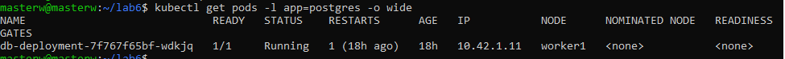
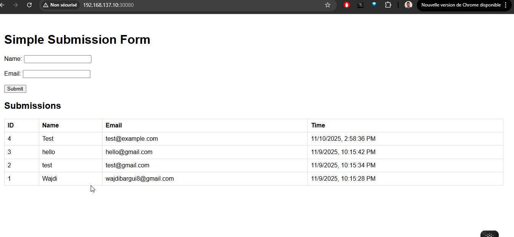

# 🧪 Lab 6 — Web App & Database Connection on Kubernetes (K3s)

## 🌐 Project Overview

This lab demonstrates how to **deploy a Node.js web application** connected to a **PostgreSQL database** inside a **K3s Kubernetes cluster**.

It introduces key Kubernetes concepts:

- ✅ Use of **Secrets** for database credentials  
- ✅ Use of **ConfigMaps** for application configuration  
- ✅ Internal communication between Pods via **ClusterIP Services**  
- ✅ Deployments for both web app and database

---

## 🏗️ Architecture Diagram

lua
Copier le code
         +---------------------------+
         |     Web Deployment         |
         |  (Node.js + Express App)   |
         +-------------+--------------+
                       |
                       v
         +---------------------------+
         |     Web Service (ClusterIP)|
         +-------------+--------------+
                       |
                       v
         +---------------------------+
         |  PostgreSQL Deployment     |
         |  (Postgres:15-alpine)      |
         +-------------+--------------+
                       |
                       v
         +---------------------------+
         |  DB Service (ClusterIP)    |
         +---------------------------+
yaml
Copier le code

---

## 📁 Directory Structure

lab6-db-connection/
├── k8s/
│ ├── configmap-app.yaml
│ ├── db-deployment.yaml
│ ├── secret-db-credentials.yaml
│ └── web-deployment.yaml
├── docs/
│ ├── web-app-running.png
│ ├── db-pod-running.png
│ └── data-test.png
└── README.md

---

## ⚙️ Kubernetes Components

### 🧾 1. ConfigMap — `configmap-app.yaml`
Holds non-sensitive configuration values.
apiVersion: v1
kind: ConfigMap
metadata:
  name: app-config
data:
  DB_HOST: "db-service"
  DB_PORT: "5432"
🔒 2. Secret — secret-db-credentials.yaml
Contains database credentials.

apiVersion: v1
kind: Secret
metadata:
  name: db-credentials
type: Opaque
stringData:
  POSTGRES_USER: myuser
  POSTGRES_PASSWORD: mypassword
  POSTGRES_DB: mydb
🗄️ 3. Database Deployment — db-deployment.yaml
Defines PostgreSQL container and storage.

apiVersion: apps/v1
kind: Deployment
metadata:
  name: db-deployment
spec:
  replicas: 1
  selector:
    matchLabels:
      app: postgres
  template:
    metadata:
      labels:
        app: postgres
    spec:
      containers:
      - name: postgres
        image: postgres:15-alpine
        ports:
        - containerPort: 5432
        envFrom:
        - secretRef:
            name: db-credentials
💻 4. Web App Deployment — web-deployment.yaml
Defines the Node.js app connecting to the DB.

apiVersion: apps/v1
kind: Deployment
metadata:
  name: web-deployment
spec:
  replicas: 1
  selector:
    matchLabels:
      app: web
  template:
    metadata:
      labels:
        app: web
    spec:
      containers:
      - name: web
        image: wajditech/lab6-webapp:latest
        ports:
        - containerPort: 3000
        envFrom:
        - configMapRef:
            name: app-config
        - secretRef:
            name: db-credentials
🚀 Deployment Steps
1️⃣ Apply All Manifests
cd k8s/
kubectl apply -f secret-db-credentials.yaml
kubectl apply -f configmap-app.yaml
kubectl apply -f db-deployment.yaml
kubectl apply -f web-deployment.yaml
2️⃣ Verify Pods & Services
kubectl get pods -o wide
kubectl get svc
✅ You should see both web and db pods running.

🧪 Testing the Application
Forward the web service port to access the app:

kubectl port-forward deployment/web-deployment 3000:3000
Then open:
👉 http://localhost:3000

Try adding and retrieving data from the form.

📸 Evidence of Success
Include screenshots in /docs:

🧹 Cleanup
To delete all resources:
kubectl delete -f k8s/